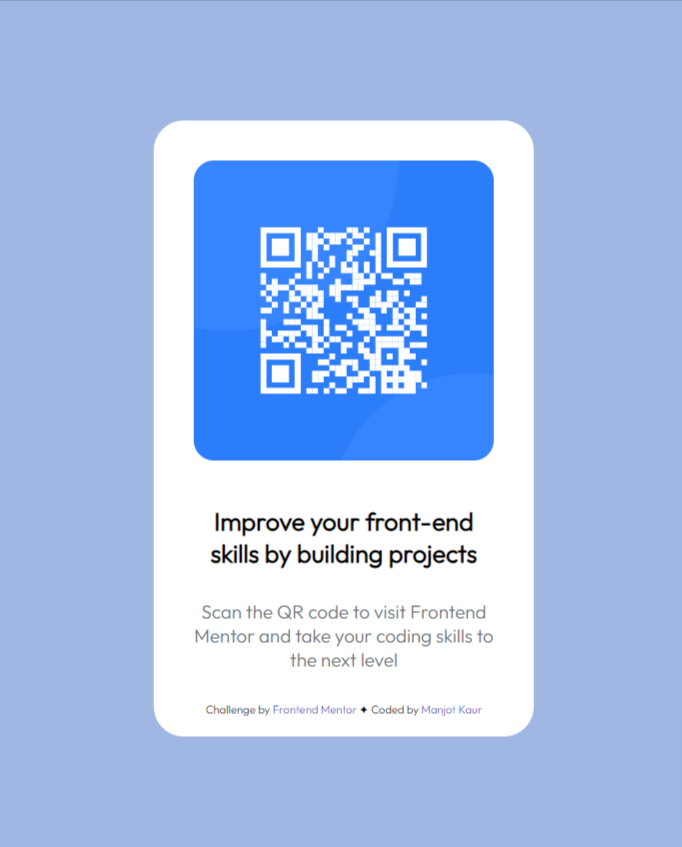

# Frontend Mentor - QR code component solution

This is a solution to the [QR code component challenge on Frontend Mentor](https://www.frontendmentor.io/challenges/qr-code-component-iux_sIO_H). Frontend Mentor challenges help you improve your coding skills by building realistic projects. 

## Table of contents

- [Overview](#overview)
  - [Screenshot](#screenshot)
  - [Links](#links)
- [My process](#my-process)
  - [Built with](#built-with)
  - [What I learned](#what-i-learned)
  - [Continued development](#continued-development)
  - [Useful resources](#useful-resources)
- [Author](#author)

## Overview

### Screenshot



### Links

- Solution URL: [Add solution URL here](https://your-solution-url.com)
- Live Site URL: [Add live site URL here](https://your-live-site-url.com)

## My process

### Built with

- Semantic HTML5 markup
- CSS custom properties
- Flexbox

### What I learned

I learnt about transitions in CSS while working on this project.

```css
img{
    display: inline-block;
    padding: 2rem; 
    width: 15rem;
    border-radius: 3rem;
    transition: transform 0.5s ease-in-out;
}
```
```css
img:hover {
    transform: scale(1.1);
}
```

### Continued development

- media queries and responsiveness

### Useful resources

- [Stack Overflow](https://www.stackoverflow.com) - This helped me for doubts regarding flexbox properties.
- [Blackbox AI](https://www.useblackbox.io/) - This is an amazing AI chatbot from which I learnt about alternative ways to position elements in a flexbox. I'd recommend it to anyone still learning this concept or wants to debug code.


## Author

- Frontend Mentor - [@mkcodes20](https://www.frontendmentor.io/profile/mkcodes20)
- Twitter - [@kaurmanjot20](https://twitter.com/kaurmanjot20)
